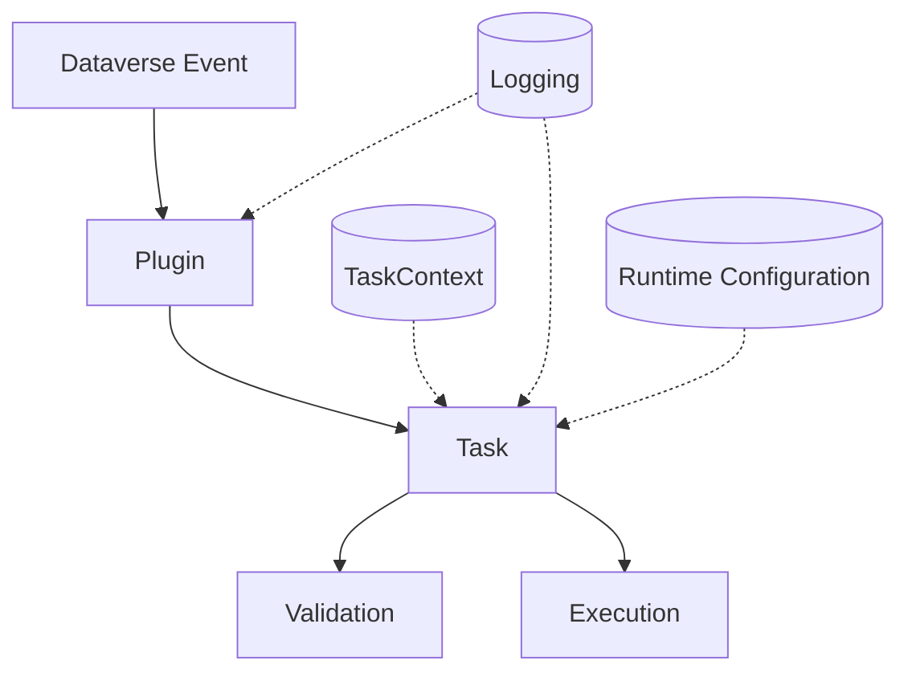

# Pillaro Dataverse Plugin Framework

> A source-available framework providing a structured, task-based approach for building predictable, testable, and maintainable Microsoft Dataverse plugins in C#.

---

## Table of Contents

- [Overview](#overview)
- [Documentation](#documentation)
- [Adoption and Support](#adoption-and-support)
- [What Problem It Solves](#what-problem-it-solves)
- [Architecture](#architecture-simplified)
- [Key Features](#key-features)
- [Getting Started](#getting-started)
- [Examples](#examples)
- [When to Use](#when-to-use)
- [Repository Structure](#repository-structure)
- [AI-Ready Structure](#ai-ready-structure)
- [Key Principles](#key-principles)
- [Operational Guidelines (Summary)](#operational-guidelines-summary)
- [Current Status](#current-status)
- [License](#license)

---

## Overview

Pillaro Framework provides a consistent way to design and implement Dataverse plugins using a **task-based execution model**.

Each piece of business logic is split into small, focused units called **Tasks** with a clear lifecycle:

1. **Validation** — can this Task run?
2. **Execution** — do the work.

This structure makes plugins predictable, testable, and easier to maintain over time.

---

## Current Status

- 🟡 Preparing for first public release
- 📝 Documentation in progress
 
---

## Documentation

Detailed documentation, including setup guides and architecture explanations, is available in the [docs](./docs/README.md) section.

---

## Adoption and Support

If you want to adopt the framework in a controlled way or ensure a smooth production rollout, we can help with:

- architecture setup and review
- best practices and patterns
- team onboarding
- production readiness

Learn more at [pillaro.cz](https://pillaro.cz).  
If you want guided onboarding, contact us through the contact form on the website.

---

## What Problem It Solves

Standard plugin development often leads to:

| Problem | Framework Solution |
|---|---|
| Large classes with mixed responsibilities | Each piece of functionality = one Task |
| Validation and execution logic combined | Validation is strictly separated from execution |
| Duplicated patterns across projects | Consistent structure enforced by base classes |
| Difficult testing and debugging | Built-in logging; Tasks are independently testable |
| No structured approach to integration testing | Built-in xUnit toolkit for writing programmatic integration tests |

### Example Scenarios

> **Note:** The following scenarios are provided solely to demonstrate the framework’s functionality. They are not designed for production use and may not meet the security, performance, or process requirements of real-world projects.

- **Automatic validation of contact names on create or update**  
  Each attempt to create or update a contact triggers the `ValidateContactNamesTask`, which:
  - ensures that both first and last name fields are filled in
  - checks that the first name does not contain forbidden words
  - returns a user-friendly error and logs the reason in detail if validation fails

- **Dynamic update of contact address label**  
  The `UpdateAddressLabel` Task, when address fields change:
  - verifies that relevant fields have actually changed using PreImage for updates
  - normalizes and concatenates address parts into a single label
  - ensures the update is performed only when necessary, minimizing unnecessary writes

- **Task summary synchronization based on changes in related entities**  
  The `TaskSummarySync` Task:
  - monitors changes in fields such as regarding, scheduled time, or task state
  - recalculates the task description based on the current state of the related record
  - uses PreImage and PostImage to compare previous and new states

- **Complex validation on owner change**  
  A set of validators within a single Task:
  - first checks basic conditions such as user permissions
  - then performs more demanding checks such as dependencies on other entities
  - keeps each rule separate for easier extension and maintenance

---

## Architecture (Simplified)

### Plugin

The entry point registered with Dataverse. It:

- receives the execution context from Dataverse
- resolves and orchestrates Tasks based on stage, message, entity, and mode
- executes Tasks in a deterministic order within a single pipeline
- handles logging, exception propagation, and transaction boundaries

### Task

A single unit of business logic. Each Task:

- has one clear responsibility
- defines validation rules in `AddValidations()`
- contains business logic in `DoExecute()`
- is executed within a shared `TaskContext`
- is independently testable

### Validation

- runs **before execution**
- uses a fluent API to define rules in a strict order
- can mark the Task as **Not Valid** so execution is skipped and the pipeline continues
- can stop execution by throwing an error when required
- does not affect other Tasks unless an exception is thrown

### Execution

- runs **only if validation passes**
- contains **pure business logic** without guard checks or validation
- produces deterministic and traceable results
- triggers a full transaction rollback on any **unhandled exception** while logs are preserved

### Shared Components

#### TaskContext

- provides access to Dataverse services and execution data
- enables lightweight data sharing between Tasks via an `Items` collection

#### Logging

- captures execution flow, validation outcomes, and errors
- is used by both Plugin and Tasks
- is persisted even if the transaction is rolled back

#### Runtime Configuration

- is loaded from Dataverse at runtime
- allows behavior changes without redeploying the plugin

---

## Key Features

### 🧩 Task-Based Architecture

Each plugin is composed of independent Tasks registered via `RegisterTask<T>()`.

- keeps business logic small and focused
- makes code easier to understand and maintain
- allows testing logic in isolation

### ✅ Fluent Validation Model

Each Task defines its own validation rules through a fluent API with enforced ordering:

1. Context filters (`WithMode`, `WithStage`, `WithMessage`)
2. Entity scope (`ForEntity` / `ForEntities`)
3. Image requirements (`HasPreImage` / `HasPostImage`)
4. Attribute presence (`EntityWithAtLeastOneAttribute` / `EntityWithAllAttributes`)
5. Custom validations (`WithValidation`)
6. Flow control (`WithBreakValidation`, `ThrowWithWarning`, `ThrowWithError`)

### ⚙️ Runtime Configuration

Configuration is stored in Dataverse and loaded at runtime.

- change behavior without redeploying plugins
- support environment-specific settings
- avoid hardcoded values

### 🔢 Autonumbering

Supports configurable number sequences.

- consistent numbering across records
- support for parent-based numbering
- safe for concurrent operations

### 📋 Diagnostic Logging

Logging is built into the execution pipeline and every Task produces a structured log automatically.

- shows exactly what happened during execution
- tracks execution flow, timing, and depth
- includes input/output parameters and entity images

### 🧪 Testing Support

Provides a foundation for testing against a real Dataverse environment.

- validates real behavior, not just isolated code
- ensures plugins work together correctly
- reduces risk in production deployments

---

## Getting Started

### Prerequisites

- **Dataverse / Dynamics 365 environment**
- **Framework solution installed** — import the `PillaroFramework.zip` solution from `power-platform-solutions/framework` into your environment. This solution contains the required configuration entities and dependencies for proper framework functionality.
- **.NET Framework 4.6.2** (required by Dataverse plugin sandbox)
- Visual Studio or Visual Studio Code
- Plugin must be deployed as a single assembly

> [!WARNING]
> If you use SPKL for early-bound entity generation, do **not** upgrade `Microsoft.CrmSdk.CoreTools` beyond version **9.1.0.92**. Higher versions break `CrmSvcUtil.exe` generation via SPKL. See [Known Limitations](./docs/README.md#-known-limitations) for details.

### Quick Start

1. Import the `PillaroFramework.zip` solution into your Dataverse environment
2. Create a Class Library project targeting .NET Framework 4.6.2
3. Add a reference to the framework via NuGet:  
   [Pillaro.Dataverse.PluginFramework](https://www.nuget.org/packages/Pillaro.Dataverse.PluginFramework)
4. Enable assembly signing for the plugin project
5. Create your solution-specific `PluginBase`
6. Create plugin classes and register Tasks
7. Implement validation and execution logic in Tasks
8. Configure the build to produce a single deployable assembly
9. Build and register the plugin assembly in Dataverse

Detailed setup, signing, packaging, and deployment guidance is available in the [Getting Started](./docs/getting-started.md).

---

### Minimal Example

#### PluginBase

~~~csharp
public class PluginBase : PluginFramework.Plugins.PluginBase
{
    public PluginBase(string unsecureConfig, string secureConfig) : base(unsecureConfig, secureConfig)
    {
    }

    public override string GetSolutionVersion()
    {
        return "1.0";
    }
}
~~~

#### Plugin

~~~csharp
public class TaskPlugin : PluginBase
{
    public TaskPlugin(string unsecureConfig, string secureConfig) : base(unsecureConfig, secureConfig)
    {
        RegisterTask<TaskAutoNumbering>(PluginStage.Preoperation, ["Create"], Task.EntityLogicalName, PluginMode.Synchronous);
        RegisterTask<TaskSummarySync>(PluginStage.Postoperation, ["Create", "Update"], Task.EntityLogicalName, PluginMode.Synchronous);
    }
}
~~~

#### Task

~~~csharp
public class TaskAutoNumbering(IServiceProvider serviceProvider, TaskContext taskContext) 
    : TaskBase<Logic.Task>(serviceProvider, taskContext)
{
    protected override ICompleteValidation AddValidations(IBasicModeValidation validator)
    {
        return validator
            .WithMode(PluginMode.Synchronous)
            .WithStage(PluginStage.Postoperation)
            .WithMessages(["Create", "Update"])
            .ForEntity(ContextEntity.LogicalName);
    }

    protected override void DoExecute()
    {
        // Business logic
    }
}
~~~

---

## When to Use

| 🚀 Highest Added Value | ⚖️ Lower Added Value (but still applicable) |
|---|---|
| Solution contains multiple plugins or integration points | Solution contains one or a few simple plugins |
| Long-term evolution and feature growth are expected | No significant future development is expected |
| Business logic is growing or expected to grow in complexity | Logic is simple, such as a single operation or basic update |
| You need reliable, repeatable automated testing | Testing is not a key requirement |
| You want consistent structure across projects and teams | Project is small, isolated, and does not need shared standards |
| Maintainability and scalability are important | Short-term or one-off solution |
| You need structured logging for debugging and observability during development | Basic or minimal logging is sufficient |
| You need the ability to adjust or toggle behavior at runtime without a new release | Behavior is static and does not need to change without deployment |

### Summary

The framework can be used in any scenario. Its core purpose is to structure the solution, support future growth, and enable a fast development start.

The difference lies in the level of value it brings in a given context.

---

## Repository Structure

~~~
/src → Framework source code
  ├─ Pillaro.Dataverse.PluginFramework
  ├─ Pillaro.Dataverse.PluginFramework.Plugins
  └─ Pillaro.Dataverse.PluginFramework.Testing
/tests → Test projects
  ├─ Pillaro.Dataverse.PluginFramework.Tests
  └─ Pillaro.Dataverse.PluginFramework.Tests.EarlyBoundGen
/examples → Sample implementations
  ├─ Pillaro.Dataverse.PluginFramework.Examples.Logic
  ├─ Pillaro.Dataverse.PluginFramework.Examples.Plugins
  └─ Pillaro.Dataverse.PluginFramework.Examples.Tests
/docs → Documentation
/power-platform-solutions → Solution files ready to import into Dataverse
  ├─ examples
  └─ framework
~~~

---

## AI-Ready Structure

The framework enforces a consistent and predictable structure, making the codebase easier to analyze and reason about for both developers and automated tools.

- functionality is split into clearly defined Tasks
- each Task has explicit validation and execution phases
- behavior is deterministic and traceable
- patterns are uniform across all plugins

This enables:

- **Automated code generation** — AI tools can reliably produce new Tasks and plugins
- **Consistent structure** — every project follows the same conventions
- **Analysis and mapping** — straightforward correlation between requirements and implementation

---

## Key Principles

| Principle | Description |
|---|---|
| **Separate validation from execution** | `AddValidations()` and `DoExecute()` are always distinct |
| **Keep logic small and focused** | One Task = one responsibility |
| **Ensure predictable behavior** | Fluent validators execute in defined order |
| **Make execution flow explicit** | Logging is automatic and every step is traceable |
| **Maintain consistency** | All plugins follow the same base pattern |
| **Versioned logging** | Update `PluginBase.GetSolutionVersion()` on each release so logs include a clear solution/version identifier |
| **Per-task programmatic tests** | Generate and maintain automated tests for every Task; tests must run in CI and nightly builds |
| **Production logging levels** | Production environments default to `Warning` or `Error` to limit log volume and storage impact |
| **Environment log retention** | Implement environment-specific log retention and cleanup to remove old logs and reduce database storage usage |
| **Nightly CI runs** | Schedule a nightly build that runs the full test matrix, including programmatic Task tests, to detect regressions early |

---

## Operational Guidelines (Summary)

The framework assumes a production-ready development approach with emphasis on testing, observability, and controlled releases.

Key practices:

- **Versioning** — update `PluginBase.GetSolutionVersion()` on each release so logs contain a clear version identifier  
- **Per-task testing** — maintain automated tests for each Task (run in CI and nightly builds)  
- **CI/CD** — run full test suite on pull requests and scheduled nightly builds  
- **Production logging** — default log level should be `Warning` or `Error`, with temporary overrides for troubleshooting  
- **Log retention** — implement cleanup strategy to prevent unnecessary database growth  

Detailed implementation (CI pipelines, scripts, examples) will be added to: 👉 `/docs/operational-guidelines.md`

---

## License

This project is licensed under the **Pillaro Community License (PCL) v1.0**.

| | |
|---|---|
| ✅ Use the framework in your projects and commercial solutions | ❌ Sell the framework as a product |
| ✅ Modify it and build on top of it | ❌ Rebrand it or present it as your own framework |
| ✅ Charge for implementation and services | ❌ Package it as a paid toolkit, platform, or SaaS where it is the main value |

If you use the framework in a delivered solution, you must include:

> "This solution is built using Pillaro Dataverse Plugin Framework."

This framework is open for use, extension, and contribution, but is not licensed as a permissive open-source project and is not intended for resale as a standalone or competing product.

See the full license in the [LICENSE](LICENSE) file.