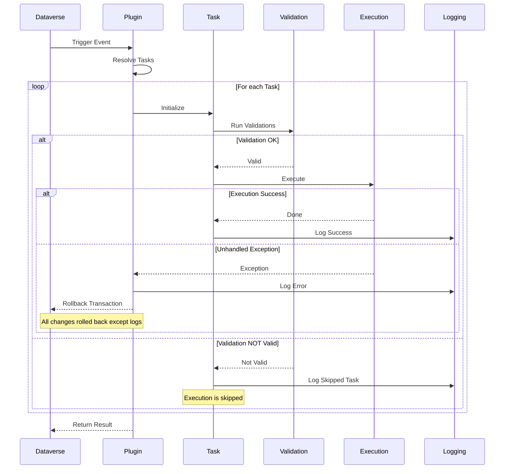

# Execution Pipeline

This document describes how the framework executes Tasks within the Dataverse plugin runtime.

---

## Overview

The framework enforces a **deterministic execution model** where all logic runs inside a single plugin `Execute` method.

Each plugin:

- resolves registered Tasks based on context (message, stage, entity, mode)
- executes them sequentially in a defined order
- shares a single execution context across all Tasks

This guarantees:

- predictable execution flow
- consistent runtime context
- controlled side effects
- testable and modular logic

---

## Core Concepts

### Single Execution Context

All Tasks share the same `TaskContext`, which:

- wraps Dataverse services and execution data
- exposes a shared `Items` collection for cross-task communication

```csharp
AddItem(key, value);
GetItem<T>(key);
```

This enables lightweight data sharing without tight coupling.

---

### Task Lifecycle

Each Task follows a strict lifecycle:

1. **Validation**
2. **Execution** (only if validation passes)

Validation and execution are always separated.

---

## Execution Behavior

### Validation Outcome

If a Task fails validation:

- it is marked as **Not Valid**
- execution is **skipped**
- the result is **logged**
- the pipeline **continues with the next Task**

This is a controlled and expected state, not an error.

---

### Execution Outcome

If validation passes:

- the Task is executed
- the result is logged
- the pipeline continues

---

### Unhandled Exception

If an unhandled exception occurs during execution:

- execution of remaining Tasks is **stopped**
- the **entire Dataverse transaction is rolled back**
- **logs are preserved** because they are not part of the business transaction

This ensures data consistency while still allowing diagnostics.

---

## Execution Flow Diagram



---

## Key Guarantees

The execution pipeline guarantees:

- **Deterministic order** — Tasks run in a defined sequence
- **Separation of concerns** — validation and execution are strictly separated
- **Non-blocking validation** — invalid Tasks do not stop the pipeline
- **Transactional safety** — failures trigger full rollback
- **Persistent diagnostics** — logs survive transaction rollback

---

## Design Implications

When designing Tasks:

- do not mix validation and execution logic
- treat validation failure as a normal outcome
- avoid side effects before execution
- assume shared context but avoid hidden dependencies
- handle expected errors explicitly; let unexpected ones fail fast

---

## Summary

The execution pipeline provides a structured and predictable way to orchestrate business logic in Dataverse plugins.

It balances:

- flexibility (independent Tasks)
- safety (transactional rollback)
- observability (persistent logging)

while maintaining a clean and testable architecture.